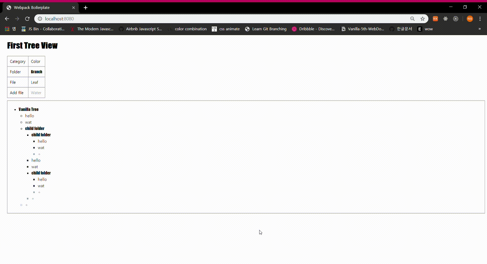

# Tree View

폴더/파일 구조를 웹으로 표현해내는 과제입니다.



## Setup

Install dependencies

```sh
$ yarn install (or npm install)
```

## Development

```sh
$ yarn dev (or npm run dev)
# visit http://localhost:8080
```

## Feature

1. 초기 구동시에는 `/app/data.js`를 이용하여 초기 구조를 형성합니다.
2. 각 폴더에는 파일을 생성할 수 있는 버튼이 있습니다. (+)
3. 파일을 더블 클릭할 경우, 파일이 폴더로 변경됩니다.
4. 파일이나 폴더를 생성할 경우, `/app/data.js`에서 가져온 객체(`TREE_DATA`)에도 정보를 수정/추가해야 합니다.
